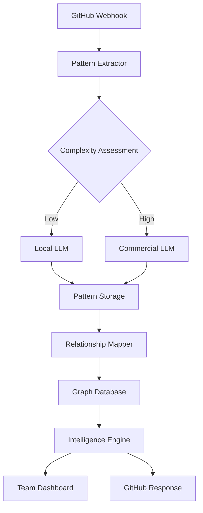

# Implementation Roadmap: Pattern Intelligence System

## Project Summary

**Objective**: Transform KnowledgePersistence-AI from content-focused repository to pattern intelligence system that develops genuine expertise through relationship mapping and multi-LLM processing.

**Key Innovation**: Focus on patterns and relationships between knowledge items rather than raw content storage. This aligns with expertise research - experts recognize patterns and relationships that others miss.

**Technical Strategy**: 
- Local LLMs for pattern extraction and relationship mapping (cost-effective, high-volume)
- Commercial LLMs for strategic reasoning and complex analysis (high-value, targeted)
- Supabase for real-time team collaboration and reduced infrastructure overhead
- PostgreSQL graph operations for relationship storage and traversal

## Phase-by-Phase Implementation

### Phase 1: Pattern Foundation (Weeks 1-2)

**Objective**: Establish pattern-first data architecture and basic extraction capabilities

**Key Deliverables**:
- [ ] Enhanced database schema with pattern-focused tables
- [ ] Basic pattern extraction for all 6 knowledge types
- [ ] Relationship mapping between patterns
- [ ] Pattern validation and quality scoring system
- [ ] PostgreSQL graph operations with recursive CTEs

**Technical Tasks**:
```sql
-- Deploy enhanced schema
CREATE TABLE patterns (
    id UUID PRIMARY KEY DEFAULT gen_random_uuid(),
    pattern_type VARCHAR(50) NOT NULL,
    title VARCHAR(200) NOT NULL,
    content JSONB NOT NULL,
    confidence FLOAT DEFAULT 0.0,
    pattern_strength FLOAT DEFAULT 0.0,
    validation_status VARCHAR(20) DEFAULT 'pending',
    created_at TIMESTAMP DEFAULT CURRENT_TIMESTAMP,
    embedding VECTOR(768),
    is_active BOOLEAN DEFAULT TRUE
);

CREATE TABLE pattern_relationships (
    id UUID PRIMARY KEY DEFAULT gen_random_uuid(),
    source_pattern_id UUID REFERENCES patterns(id),
    target_pattern_id UUID REFERENCES patterns(id),
    relationship_type VARCHAR(50) NOT NULL,
    strength FLOAT DEFAULT 0.0,
    confidence FLOAT DEFAULT 0.0,
    evidence JSONB DEFAULT '{}'
);
```

**Success Metrics**:
- Pattern extraction accuracy > 80%
- Relationship mapping precision > 70%
- System processes 100+ interactions/day
- Basic graph operations respond < 1 second

### Phase 2: Local LLM Integration (Weeks 3-4)

**Objective**: Deploy local models for cost-effective pattern processing

**Key Deliverables**:
- [ ] Local LLM deployment (CodeLlama, Llama2, Mistral)
- [ ] Hybrid routing system (local vs commercial)
- [ ] Pattern prediction engine
- [ ] Real-time pattern processing pipeline
- [ ] Cost tracking and optimization

**Technical Tasks**:
```python
class HybridPatternProcessor:
    def __init__(self):
        self.local_models = {
            'pattern_extraction': OllamaModel("codellama:13b-instruct"),
            'relationship_mapping': OllamaModel("llama2:13b-chat"),
            'content_analysis': OllamaModel("mistral:7b-instruct")
        }
        
        self.commercial_models = {
            'strategic_analysis': AnthropicClient(),
            'complex_reasoning': OpenAIClient()
        }
        
        self.cost_optimizer = CostOptimizer()
    
    async def process_interaction(self, interaction_data):
        # Route based on complexity and cost constraints
        routing_decision = self.cost_optimizer.route_task(interaction_data)
        
        if routing_decision.use_local:
            return await self.process_with_local_model(interaction_data)
        else:
            return await self.process_with_commercial_model(interaction_data)
```

**Success Metrics**:
- 70% of tasks processed locally
- API costs reduced by 60-80%
- Pattern processing time < 5 seconds
- Local model accuracy > 75%

### Phase 3: Team Collaboration (Weeks 5-6)

**Objective**: Enable real-time team pattern sharing and collaboration

**Key Deliverables**:
- [ ] Migration to Supabase with team support
- [ ] Real-time pattern sharing across team members
- [ ] Project-based access control with row-level security
- [ ] Team dashboard for pattern insights
- [ ] Pattern validation and feedback system

**Technical Tasks**:
```typescript
// Real-time pattern subscription
const patternSubscription = supabase
  .channel('pattern-updates')
  .on('postgres_changes', 
    { 
      event: 'INSERT', 
      schema: 'public', 
      table: 'patterns',
      filter: `project_id=eq.${currentProjectId}`
    }, 
    (payload) => {
      updatePatternDisplay(payload.new)
    }
  )
  .subscribe()
```

**Success Metrics**:
- All team members actively using pattern insights
- Real-time updates < 1 second latency
- Team pattern creation rate > 50 patterns/week
- User satisfaction score > 4.5/5

### Phase 4: Intelligence Layer (Weeks 7-8)

**Objective**: Implement advanced pattern analysis and insight generation

**Key Deliverables**:
- [ ] Cross-pattern analysis and clustering
- [ ] Automated insight generation
- [ ] Pattern evolution tracking
- [ ] Predictive recommendations
- [ ] Knowledge synthesis engine

**Technical Tasks**:
```python
class PatternIntelligenceEngine:
    async def analyze_pattern_clusters(self, project_id):
        # Identify pattern clusters using graph traversal
        clusters = await self.find_pattern_clusters(project_id)
        
        # Generate insights from clusters
        insights = await self.generate_cluster_insights(clusters)
        
        # Predict future patterns
        predictions = await self.predict_future_patterns(clusters)
        
        return {
            'clusters': clusters,
            'insights': insights,
            'predictions': predictions
        }
```

**Success Metrics**:
- Pattern prediction accuracy > 60%
- Insight generation rate > 10 insights/week
- Cross-pattern relationships identified > 100/week
- Prediction lead time > 2 days

### Phase 5: GitHub Integration (Weeks 9-10)

**Objective**: Automate project management through pattern-driven GitHub integration

**Key Deliverables**:
- [ ] GitHub webhook integration for automatic pattern extraction
- [ ] Proactive project recommendations
- [ ] Pattern-based automation (issue labeling, PR review)
- [ ] AI agent orchestration system
- [ ] Automated code quality insights

**Technical Tasks**:
```python
class GitHubPatternIntegration:
    async def handle_pull_request(self, pr_data):
        # Extract patterns from PR
        patterns = await self.extract_pr_patterns(pr_data)
        
        # Find similar patterns from history
        similar_patterns = await self.find_similar_patterns(patterns)
        
        # Generate recommendations
        recommendations = await self.generate_pr_recommendations(
            patterns, similar_patterns
        )
        
        # Post insights to PR
        await self.post_pr_insights(pr_data['number'], recommendations)
```

**Success Metrics**:
- 90% of PRs receive automated insights
- 70% of recommendations rated as helpful
- Issue resolution time reduced by 40%
- Code quality improvements measurable

## Technical Architecture

### Core Components

**1. Pattern Processing Pipeline**
```
Raw Input → Content Analysis → Pattern Extraction → Relationship Mapping → Graph Storage → Intelligence Layer
```

**2. Multi-LLM Orchestration**
```
Task Analysis → Complexity Assessment → Model Selection → Processing → Result Validation → Storage
```

**3. Real-Time Collaboration**
```
Pattern Discovery → Supabase Storage → Real-Time Broadcast → Team Notification → Collaborative Validation
```

**4. GitHub Integration**
```
Webhook Event → Pattern Extraction → Historical Analysis → Recommendation Generation → Automated Response
```

### Data Flow Architecture



## Resource Requirements

### Infrastructure
- **Supabase Pro**: $25/month for team collaboration
- **Local LLM Server**: Existing infrastructure (GPU recommended)
- **GitHub Integration**: Webhook processing
- **Monitoring**: Pattern quality and system performance

### Development Time
- **Total Estimated Time**: 10 weeks
- **Team Size**: 1-2 developers
- **Complexity**: Moderate to High
- **Risk Level**: Low to Moderate

### Cost Optimization
- **Current API Costs**: ~$100/day (estimated)
- **Target API Costs**: ~$20/day (80% reduction)
- **Infrastructure Costs**: ~$50/month additional
- **ROI Timeline**: 3-6 months

## Success Metrics and KPIs

### Technical Metrics
- **Pattern Extraction Accuracy**: >85%
- **Relationship Mapping Precision**: >70%
- **System Response Time**: <2 seconds
- **API Cost Reduction**: >75%
- **Pattern Processing Volume**: >500 patterns/day

### Business Metrics
- **Team Adoption Rate**: >90%
- **Pattern Validation Rate**: >80%
- **Insight Actionability**: >70%
- **Project Management Efficiency**: +40%
- **Code Quality Improvement**: Measurable metrics

### Innovation Metrics
- **Cross-Project Pattern Reuse**: >50%
- **Predictive Accuracy**: >60%
- **Automated Recommendation Acceptance**: >70%
- **Knowledge Synthesis Rate**: >10 insights/week

## Risk Mitigation

### Technical Risks
- **Local LLM Performance**: Benchmark against commercial models
- **Pattern Quality**: Implement validation scoring
- **System Complexity**: Phased rollout with rollback capabilities
- **Data Migration**: Comprehensive backup and testing

### Business Risks
- **Team Adoption**: Gradual rollout with training
- **Over-Engineering**: Focus on practical value
- **Vendor Lock-in**: Maintain data portability
- **Cost Overruns**: Continuous monitoring and optimization

## Implementation Timeline

```
Week 1-2:   Pattern Foundation
Week 3-4:   Local LLM Integration  
Week 5-6:   Team Collaboration
Week 7-8:   Intelligence Layer
Week 9-10:  GitHub Integration
Week 11-12: Testing and Optimization
```

## Conclusion

This roadmap transforms KnowledgePersistence-AI from a content repository to a pattern intelligence system that develops genuine expertise through relationship mapping and multi-LLM processing. The phased approach ensures manageable implementation while delivering incremental value.

**Key Success Factors**:
1. **Pattern-First Architecture**: Focus on relationships over content
2. **Cost-Effective Processing**: Local LLMs for routine tasks
3. **Team Collaboration**: Real-time sharing and validation
4. **Practical Integration**: GitHub workflow automation
5. **Continuous Learning**: System improves through usage

The result is a system that truly becomes a strategic partner rather than just a knowledge repository, developing expertise that compounds over time and provides proactive insights for project management and software development.
