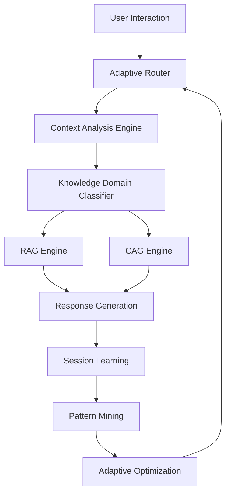

# KnowledgePersistence-AI v2: Adaptive RAG-CAG System

## Design Philosophy: Maximum Adaptability

**Core Principle**: Build an adaptive system that learns and evolves based on usage patterns while maintaining excellence in coding tasks.

**Key Insight**: You're already successfully using this as both a knowledge persistence system AND a primary coding assistant. V2 should amplify both capabilities without forcing artificial boundaries.

## Current State Analysis

### What's Working Well
- **Effective RAG-CAG**: Current implementation providing real value
- **Cross-project persistence**: Knowledge flows between projects naturally
- **Coding excellence**: System maintains strong coding capabilities
- **Session mining**: Storing all AI agent sessions for future insight extraction

### V2 Opportunity
- **New database**: Clean slate implementation
- **Adaptive architecture**: System learns and optimizes based on usage
- **Enhanced pattern recognition**: From session mining and real-time analysis
- **Maintained coding focus**: Don't sacrifice coding effectiveness for abstraction

## V2 Architecture: Adaptive Intelligence Layer

### Core Components



### Adaptive Router
**Purpose**: Intelligently route requests based on context, history, and learned patterns

```python
class AdaptiveRouter:
    def __init__(self):
        self.usage_patterns = UsagePatternAnalyzer()
        self.context_classifier = ContextClassifier()
        self.performance_tracker = PerformanceTracker()
        
    async def route_request(self, user_input, session_context):
        # Analyze request type and context
        request_analysis = await self.analyze_request(user_input, session_context)
        
        # Determine optimal processing strategy
        strategy = self.determine_strategy(request_analysis)
        
        # Route to appropriate engine
        if strategy.type == 'coding_focused':
            return await self.route_to_coding_engine(request_analysis)
        elif strategy.type == 'knowledge_synthesis':
            return await self.route_to_synthesis_engine(request_analysis)
        elif strategy.type == 'project_management':
            return await self.route_to_pm_engine(request_analysis)
        else:
            return await self.route_to_general_engine(request_analysis)
    
    def determine_strategy(self, request_analysis):
        """Adaptive strategy selection based on learned patterns"""
        # Factor in historical performance
        historical_performance = self.performance_tracker.get_performance_for_context(
            request_analysis.context
        )
        
        # Factor in usage patterns
        usage_patterns = self.usage_patterns.get_patterns_for_context(
            request_analysis.context
        )
        
        # Adapt based on success rates
        return self.optimize_strategy(historical_performance, usage_patterns)
```

### Context Analysis Engine
**Purpose**: Deep understanding of request context for optimal knowledge retrieval

```python
class ContextAnalysisEngine:
    def __init__(self):
        self.local_llm = LocalLLM("llama2:13b-chat")
        self.embedding_model = LocalEmbedding("all-mpnet-base-v2")
        self.session_analyzer = SessionAnalyzer()
    
    async def analyze_context(self, user_input, session_history):
        # Multi-dimensional context analysis
        context_dimensions = {
            'intent': await self.analyze_intent(user_input),
            'domain': await self.classify_domain(user_input, session_history),
            'complexity': await self.assess_complexity(user_input),
            'coding_focus': await self.detect_coding_focus(user_input),
            'project_context': await self.extract_project_context(session_history),
            'urgency': await self.assess_urgency(user_input),
            'knowledge_gaps': await self.identify_knowledge_gaps(user_input, session_history)
        }
        
        return ContextAnalysis(context_dimensions)
    
    async def analyze_intent(self, user_input):
        """Classify user intent with high accuracy"""
        prompt = f"""
        Analyze the user's intent from this input: {user_input}
        
        Classify as one of:
        - code_generation: Writing new code
        - code_review: Reviewing/improving existing code
        - debugging: Fixing code issues
        - architecture: System design and architecture
        - knowledge_query: Information retrieval
        - problem_solving: Complex problem analysis
        - project_management: PM tasks and planning
        
        Respond with: intent_type, confidence_score, reasoning
        """
        
        response = await self.local_llm.process(prompt)
        return self.parse_intent_response(response)
```

### Knowledge Domain Classifier
**Purpose**: Intelligently classify and route knowledge without rigid boundaries

```python
class KnowledgeDomainClassifier:
    def __init__(self):
        self.domain_patterns = DomainPatternLearner()
        self.cross_domain_mapper = CrossDomainMapper()
        
    async def classify_request(self, context_analysis):
        # Primary domain classification
        primary_domain = await self.classify_primary_domain(context_analysis)
        
        # Secondary domain influence
        secondary_domains = await self.identify_secondary_domains(context_analysis)
        
        # Cross-domain pattern matching
        cross_domain_patterns = await self.find_cross_domain_patterns(
            primary_domain, secondary_domains
        )
        
        return DomainClassification(
            primary=primary_domain,
            secondary=secondary_domains,
            cross_domain_patterns=cross_domain_patterns,
            confidence=self.calculate_confidence(context_analysis)
        )
    
    async def classify_primary_domain(self, context_analysis):
        """Flexible domain classification that learns from usage"""
        # Don't force rigid categories - learn from actual usage patterns
        usage_patterns = self.domain_patterns.get_patterns_for_context(context_analysis)
        
        # Classify based on learned patterns, not predetermined categories
        return self.domain_patterns.classify_from_patterns(
            context_analysis, usage_patterns
        )
```

### Enhanced RAG Engine
**Purpose**: Retrieval-Augmented Generation optimized for coding and knowledge tasks

```python
class AdaptiveRAGEngine:
    def __init__(self):
        self.knowledge_retriever = KnowledgeRetriever()
        self.context_ranker = ContextRanker()
        self.coding_context_optimizer = CodingContextOptimizer()
        
    async def retrieve_and_generate(self, query, context_analysis, domain_classification):
        # Adaptive retrieval based on context
        if context_analysis.coding_focus > 0.7:
            # Optimize for coding tasks
            relevant_context = await self.retrieve_coding_context(
                query, context_analysis, domain_classification
            )
        else:
            # General knowledge retrieval
            relevant_context = await self.retrieve_general_context(
                query, context_analysis, domain_classification
            )
        
        # Rank and filter context for relevance
        ranked_context = await self.context_ranker.rank_context(
            relevant_context, context_analysis
        )
        
        # Generate response with optimal context
        return await self.generate_response(query, ranked_context, context_analysis)
    
    async def retrieve_coding_context(self, query, context_analysis, domain_classification):
        """Specialized retrieval for coding tasks"""
        # Retrieve relevant code patterns
        code_patterns = await self.knowledge_retriever.get_code_patterns(
            query, domain_classification.primary
        )
        
        # Retrieve relevant technical documentation
        tech_docs = await self.knowledge_retriever.get_technical_docs(
            query, domain_classification.primary
        )
        
        # Retrieve debugging patterns if applicable
        if context_analysis.intent == 'debugging':
            debug_patterns = await self.knowledge_retriever.get_debug_patterns(
                query, domain_classification.primary
            )
            return self.combine_contexts(code_patterns, tech_docs, debug_patterns)
        
        return self.combine_contexts(code_patterns, tech_docs)
```

### Enhanced CAG Engine
**Purpose**: Context-Augmented Generation with adaptive caching and learning

```python
class AdaptiveCAGEngine:
    def __init__(self):
        self.context_cache = AdaptiveContextCache()
        self.pattern_learner = PatternLearner()
        self.performance_optimizer = PerformanceOptimizer()
        
    async def augment_and_generate(self, query, context_analysis):
        # Adaptive context loading based on learned patterns
        context_strategy = await self.determine_context_strategy(
            query, context_analysis
        )
        
        # Load context using adaptive strategy
        augmented_context = await self.load_adaptive_context(
            query, context_analysis, context_strategy
        )
        
        # Generate response with context augmentation
        response = await self.generate_with_context(
            query, augmented_context, context_analysis
        )
        
        # Learn from this interaction
        await self.learn_from_interaction(
            query, context_analysis, augmented_context, response
        )
        
        return response
    
    async def determine_context_strategy(self, query, context_analysis):
        """Adaptively determine optimal context loading strategy"""
        # Analyze query complexity and context requirements
        complexity_score = context_analysis.complexity
        
        # Check historical performance for similar queries
        historical_performance = await self.performance_optimizer.get_performance_for_similar(
            query, context_analysis
        )
        
        # Determine optimal strategy
        if complexity_score > 0.8:
            return ContextStrategy.DEEP_CONTEXT
        elif context_analysis.coding_focus > 0.7:
            return ContextStrategy.CODE_FOCUSED
        elif historical_performance.context_efficiency > 0.8:
            return ContextStrategy.EFFICIENT_CONTEXT
        else:
            return ContextStrategy.BALANCED_CONTEXT
```

## Database Schema: V2 Clean Architecture

### Core Tables

```sql
-- Sessions table for comprehensive session tracking
CREATE TABLE sessions (
    id UUID PRIMARY KEY DEFAULT gen_random_uuid(),
    user_id UUID NOT NULL,
    project_context VARCHAR(200),
    session_type VARCHAR(50), -- 'coding', 'knowledge', 'mixed', 'project_management'
    started_at TIMESTAMP DEFAULT CURRENT_TIMESTAMP,
    ended_at TIMESTAMP,
    total_interactions INTEGER DEFAULT 0,
    session_metadata JSONB DEFAULT '{}',
    effectiveness_score FLOAT DEFAULT 0.0,
    adaptive_insights JSONB DEFAULT '{}'
);

-- Interactions table for all user-AI exchanges
CREATE TABLE interactions (
    id UUID PRIMARY KEY DEFAULT gen_random_uuid(),
    session_id UUID REFERENCES sessions(id),
    user_input TEXT NOT NULL,
    ai_response TEXT NOT NULL,
    context_analysis JSONB,
    domain_classification JSONB,
    routing_strategy VARCHAR(50),
    processing_time_ms INTEGER,
    effectiveness_score FLOAT,
    created_at TIMESTAMP DEFAULT CURRENT_TIMESTAMP,
    interaction_metadata JSONB DEFAULT '{}'
);

-- Adaptive patterns table for learned behaviors
CREATE TABLE adaptive_patterns (
    id UUID PRIMARY KEY DEFAULT gen_random_uuid(),
    pattern_type VARCHAR(50), -- 'routing', 'context', 'domain', 'performance'
    pattern_signature TEXT, -- Hash of pattern characteristics
    pattern_data JSONB,
    usage_count INTEGER DEFAULT 0,
    success_rate FLOAT DEFAULT 0.0,
    confidence_score FLOAT DEFAULT 0.0,
    created_at TIMESTAMP DEFAULT CURRENT_TIMESTAMP,
    updated_at TIMESTAMP DEFAULT CURRENT_TIMESTAMP,
    effectiveness_evidence JSONB DEFAULT '{}'
);

-- Knowledge domains table (learned, not predefined)
CREATE TABLE knowledge_domains (
    id UUID PRIMARY KEY DEFAULT gen_random_uuid(),
    domain_name VARCHAR(100) NOT NULL,
    domain_description TEXT,
    domain_characteristics JSONB,
    related_domains UUID[] DEFAULT '{}',
    usage_frequency INTEGER DEFAULT 0,
    effectiveness_metrics JSONB DEFAULT '{}',
    is_discovered BOOLEAN DEFAULT TRUE, -- System discovered vs user defined
    created_at TIMESTAMP DEFAULT CURRENT_TIMESTAMP
);

-- Context cache for adaptive retrieval
CREATE TABLE context_cache (
    id UUID PRIMARY KEY DEFAULT gen_random_uuid(),
    cache_key VARCHAR(200) NOT NULL,
    context_data JSONB,
    context_type VARCHAR(50),
    hit_count INTEGER DEFAULT 0,
    last_accessed TIMESTAMP DEFAULT CURRENT_TIMESTAMP,
    effectiveness_score FLOAT DEFAULT 0.0,
    expires_at TIMESTAMP,
    cache_metadata JSONB DEFAULT '{}'
);

-- Performance metrics for continuous optimization
CREATE TABLE performance_metrics (
    id UUID PRIMARY KEY DEFAULT gen_random_uuid(),
    metric_type VARCHAR(50), -- 'response_time', 'accuracy', 'user_satisfaction'
    metric_context JSONB,
    metric_value FLOAT,
    measurement_timestamp TIMESTAMP DEFAULT CURRENT_TIMESTAMP,
    related_interaction_id UUID REFERENCES interactions(id),
    improvement_insights JSONB DEFAULT '{}'
);
```

### Indexes for Performance

```sql
-- Adaptive pattern matching indexes
CREATE INDEX idx_adaptive_patterns_type ON adaptive_patterns(pattern_type);
CREATE INDEX idx_adaptive_patterns_signature ON adaptive_patterns(pattern_signature);
CREATE INDEX idx_adaptive_patterns_success ON adaptive_patterns(success_rate DESC);

-- Context cache optimization indexes
CREATE INDEX idx_context_cache_key ON context_cache(cache_key);
CREATE INDEX idx_context_cache_type ON context_cache(context_type);
CREATE INDEX idx_context_cache_accessed ON context_cache(last_accessed DESC);

-- Performance analysis indexes
CREATE INDEX idx_performance_metrics_type ON performance_metrics(metric_type);
CREATE INDEX idx_performance_metrics_timestamp ON performance_metrics(measurement_timestamp DESC);

-- Session analysis indexes
CREATE INDEX idx_sessions_project ON sessions(project_context);
CREATE INDEX idx_sessions_type ON sessions(session_type);
CREATE INDEX idx_sessions_effectiveness ON sessions(effectiveness_score DESC);
```

## Adaptive Learning Mechanisms

### Pattern Recognition and Learning

```python
class AdaptiveLearningEngine:
    def __init__(self):
        self.pattern_miner = PatternMiner()
        self.effectiveness_tracker = EffectivenessTracker()
        self.optimization_engine = OptimizationEngine()
        
    async def learn_from_session(self, session_data):
        """Learn from complete session patterns"""
        # Extract patterns from session
        session_patterns = await self.pattern_miner.extract_session_patterns(session_data)
        
        # Analyze effectiveness
        effectiveness_analysis = await self.effectiveness_tracker.analyze_session(
            session_data
        )
        
        # Update adaptive patterns
        for pattern in session_patterns:
            await self.update_adaptive_pattern(pattern, effectiveness_analysis)
        
        # Optimize routing and context strategies
        await self.optimization_engine.optimize_strategies(
            session_patterns, effectiveness_analysis
        )
    
    async def update_adaptive_pattern(self, pattern, effectiveness_analysis):
        """Update pattern database with new evidence"""
        existing_pattern = await self.find_similar_pattern(pattern)
        
        if existing_pattern:
            # Update existing pattern
            await self.merge_pattern_evidence(existing_pattern, pattern, effectiveness_analysis)
        else:
            # Create new pattern
            await self.create_new_pattern(pattern, effectiveness_analysis)
```

### Continuous Optimization

```python
class ContinuousOptimizer:
    def __init__(self):
        self.performance_analyzer = PerformanceAnalyzer()
        self.strategy_optimizer = StrategyOptimizer()
        
    async def optimize_system_performance(self):
        """Continuously optimize system based on performance data"""
        # Analyze recent performance
        recent_performance = await self.performance_analyzer.analyze_recent_performance()
        
        # Identify optimization opportunities
        optimization_opportunities = await self.identify_optimization_opportunities(
            recent_performance
        )
        
        # Apply optimizations
        for opportunity in optimization_opportunities:
            await self.apply_optimization(opportunity)
    
    async def apply_optimization(self, opportunity):
        """Apply specific optimization based on learned patterns"""
        if opportunity.type == 'routing_optimization':
            await self.strategy_optimizer.optimize_routing_strategy(opportunity)
        elif opportunity.type == 'context_optimization':
            await self.strategy_optimizer.optimize_context_strategy(opportunity)
        elif opportunity.type == 'cache_optimization':
            await self.strategy_optimizer.optimize_cache_strategy(opportunity)
```

This V2 architecture maintains your coding effectiveness while building maximum adaptability through learned patterns and continuous optimization. The system evolves based on actual usage rather than predetermined categories.

Would you like me to continue with the implementation details for any specific component?
